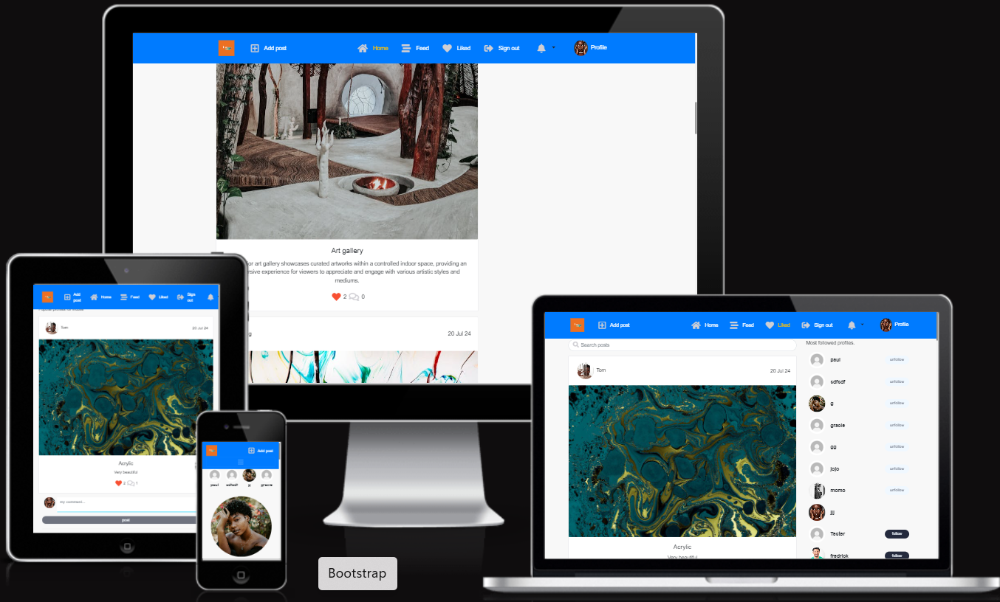

## Testing

       
Visit the deployed site: [Arts Site](https://arts-afro-4626ca68624f.herokuapp.com/)

# Testing

Throughout the project, I tested functionality and styling after building each section or function/model, making any necessary corrections before moving forward. I consistently used Google Developer Tools to verify proper functionality and to diagnose unexpected issues. Additionally, I thoroughly inspected each page using both Google Chrome Developer Tools and the Firefox Inspector Tool to ensure responsiveness across different screen sizes and devices. I also had friends test the site by signing up, adding, and deleting comments on various devices and platforms (iOS, Android, mobile, tablet, etc.), and they reported any issues they encountered with functionality or styling.

___

## CONTENTS

- [AUTOMATED TESTING](#automated-testing)
  - [Bugs](#bugs)
- [Lighthouse](#lighthouse)
- [MANUAL TESTING](#manual-testing)
  - [Validation Testing](#validation-testing)
  - [HTML \& CSS](#html--css)
  - [Python Testing](#python-testing)
  - [Full Testing](#full-testing)
             
         
## Lighthouse Testing

Lighthouse testing was conducted, and the performance was found to be poor. This is not surprising given the large number of images, but performance could be improved in the future by compressing images before uploading them. Unfortunately, I wasn't able to implement this feature in this iteration.

Lighthouse reported some errors that I was unable to fix, but the app is functioning as expected.

Mobile

Desktop

## Manual Testing

# Posts

| TEST | Description | Steps | Expected | Actual | PASS/FAIL |
|:---:|:---:|:---:|:---:|:---:|:---:|
| Test  1| Ensure post list page returns all posts | Navigate to the Deployed site | All posts displays in order of the newest first | As expected | Pass |
| Test  2 | Ensure the post detail page is displays on | 1. Navigate to deployed site.     2.    Click on tthe post.  | Post detail page displayed with all fields | As expected | Pass |
| Test 3 | Ensure post can be edited by user who created it | 1. Go to the post detail of a post sign in as creator. 2. Click the 3 dots. 3. Click the pencil to paper edit icon. 4. Alter all fields. 5. Click save. | User can edit their own post successfully | As expected | PASS |
| Test 4 | Ensure post image field has max value of 5mb | 1. As logged in user, Click Add post. 2. In the image filed attempt to upload a file > 5mb. 3. Click save. | Image larger than 5mb cannot be uploaded | As expected | PASS |
| Test 6 |Ensure post can be delete by user who created it | 1. Go to post details of a post signed in as creator 2. Click the 3 dots 3. Click the trash icon | User can delete their own post Successfully | As expected | PASS |
| Test 7 | Ensure posts correctly calculates comment count | 1. Make several comments on the same post | 2. Count number of comments made     Comment calcuates the sum of all comments | As expected | PASS |
| Test 8 | Ensure liked posts display all liked posts | Click the Feed nav link | Only posts liked current user are displayed | As expected | PASS |
| Feed page | Ensure feed page shows only followed user posts | 1. Log in. 2. Click the Feed nav link | Only posts liked by the current user 'followed' displayed | As expected | PASS |
| Logged in User | Ensuer logged in user can create post | 1. Log in.   2. Cilck add nav link  3. Fill in all fields | Post successfully created | As expected | PASS |
| Infinite scroll | Ensure infinite scroll works as expected | 1. Ensure 10+ posts are on the feed.   2. Scroll down to 10th post or more | New post load and scroll bar shrinks | As expected | PASS |
| Search bar | Ensure search bar on post works as expected | Search for the word in a current post | All posts containing search keyword are displayed | As expected | PASS |
| Unlike a post | Ensure a post can be unliked | 1. Log in the main site.   2. Click on a liked heart (red) | Love heart button loses red color and is unlike | As expected | PASS |
| Like a post | Ensure a post can be liked | 1. Log in to the main site    2. Click the heart button on post | Love heart button highlight red when like | As expected | PASS |

# Comments

User/Admin
| TEST | Description | Steps | Expected | Actual | PASS/FAIL |
|:---:|:---:|:---:|:---:|:---:|:---:|
| Test 1 | Ensure user can create a comment | 1. Click a post to open the post detail page    2. scroll to the bottom of the post    3. Type in a comment in the text area    4. Click post button. | User can successfully create a comment | As expected | PASS |
| Test 2 | Ensure user can edit a comment | 1. Click a post to open the post detail page.   2. Scroll to comment section.   3. Click 3 dots on a comments left by current user.   4. Edit the comment.    5. Click save. | User can successfully creat a comment  |As expected | PASS |
| Test 3. | Ensure user can delete a comment | 1. Click a post to open open the detail page.   2. Scroll to comments section.   3. Click 3 dots on a comment left by current user.    4. Click the trash icon | User can successfully delete their own comment | As expected | PASS |
| Test 4. | Ensure date is formatted correctly on UI | 1.  Click a post to open the post detail page.   2. Ensure date is present. | Date is  present and formatted correctly , e.g 04 Sep 24 | As expected | PASS |
| Test 5. | Ensure all comments can be viewed | 1. Click a post to open the post detail page.   2. Scroll to comment section. | Comments visble under the post details | As expected | PASS |

# Profiles

User
| TEST | Description | Steps | Expected | Actual | PASS/FAIL |
|:---:|:---:|:---:|:---:|:---:|:---:|
| Test 1 | Ensure user can edit a profile | 1. Navigate to the profile page.   2. Click the 3 dots.   3. Select edit profile.    4. Fill in form.   5. Click Save | User can edit their own profile | As expected | PASS |
| Test 2 | Ensure profile page displays correct content | Navigate to profile page | Profile page displayed with correct user infor as per model | As expected | PASS |
| Test 3 | Ensure users can unfollow other users | 1. Navigate to posts page | Popular profile list displayed | As expected | PASS |
| Test 4 | Ensure users can follow other users | 1. Click follow on a user from profiles | User can successfully follow another user and 'follow' changes to 'unfollow' | As expected | PASS |
| Test 5 | Ensure users can unfollow other users | 1. Click unfollow on a user that current user follows | User can successfully unfollow another user and 'unfollow' changes to 'follow' | As expected | PASS |
| Test 5 | Ensure user can change username | 1. Navigate to the profile page.    2. Click the 3 dots.    3. Select edit username.     4. Fill in form.    5. Click save. | User can successfully change their user name | As expected | PASS |
| Test No 6 | Ensure user can change their password | 1.  Navigate to the profile page.     2. Click the 3 dots.    3. Select edit Password.     4. Fill in form.    5. Click save. | User can successfully change their password | As expected | PASS |
| Test 6 | Ensure all posts by user can be seen on the profile | 1. Navigate to the profile page.     2. Scroll below users details. | Users posts displayed on their profile | As expected | PASS |

# Authorizsation 
User
| TEST | Description | Steps | Expected | Actual | PASS/FAIL |
|:---:|:---:|:---:|:---:|:---:|:---:|
| Test 1 | Ensure user can register | 1. Navigate to main site.      2. Click sign up.      3. Fill form in.      4. Click sign up. | User successfully signed up | As expected | PASS |
| Test 2 | Ensure user can log in | 1. Navigate to main site.      2. Click sign in.   |  User Successfully logged in. | As expected | PASS |
| Test 3 | Ensure signed out users see correct nav links | 1. As a logged in user click sign out. | Signed out successfully, Sign in and sign up links visible | As expected | PASS |

# Notifications

ADMIN
| TEST | Description | Steps | Expected | Actual | PASS/FAIL |
|:---:|:---:|:---:|:---:|:---:|:---:|
| Test 1 | Ensuer user can turn on and off their own bell |  Click on the bell on the nav bar | Bell turns on successfully and off well | As expected | Pass |
|  Test 2 |User can Delete a notitfication |  As  a logged in user can delete their notifications after veiw or even before veiwing them | Click on the bell on the nav bar | As expected | PASS

* Open browser and navigate to 
* Open the developer tools (right click and inspect)
* Set to responsive and decrease width to 320px
* Set the zoom to 50%
* Click and drag the responsive window to maximum width

Expected:

## Deployment
## Heroku Deployment

* Navigate to heroku and create an account
* Click the new button in the top right corner
* Select create new app
* Enter app name
* Select region and click create app
* Click the resources tab and search for Heroku Postgres
* Select hobby dev and continue

* Click the deploy tab
* Scroll down to Connect to GitHub and sign in / authorize when prompted
* In the search box, find the repositoy you want to deploy and click connect
* Scroll down to Manual deploy and choose the main branch
* Click deploy

 
The live link can be found here: [Live Site - Sizzle and Steak](https://arts-afro-4626ca68624f.herokuapp.com/)
 
     
       

## Responsiveness
   
All pages were tested to ensure responsiveness on screen sizes from 320px and upwards, in accordance with the WCAG 2.1 Reflow criteria for responsive design, using Chrome, Edge, Firefox, and Opera browsers.

Steps to test:

Open your browser and navigate to arts.
Open the developer tools (right-click and select Inspect).
Switch to responsive mode and reduce the width to 320px.
Set the zoom to 50%.
Click and drag the responsive window to its maximum width.
Expected:

Website is responsive on all screen sizes and no images are pixelated or stretched. No horizontal scroll is present. No elements overlap.

Actual:

Website behaved as expected.

Website was also opened on the following devices and no responsive issues were seen:

Oukitel C21 Pro TCL 30 Pro iPhone SE

## Eslint

Eslint was installed and configured locally. After running, one warning appeared about react version not specified but some error were logged.
  
## Validators

All CSS files were individually validated. 1 error was found relating to the scroll bar and the offending line subsequently removed.

## Bugs and their fixes

I encountered an error when running yarn start. A screenshot of the error is attached below. This issue occurred at the last minute, preventing me from running the server again

I also encountered a 500 error in the dev tools that I couldn't fix due to time constraints. I acknowledge that I was a bit slower this time and had a lot to manage.

Some errors in the dev tools are expected.
These errors were also present in the walkthrough, so they are expected.